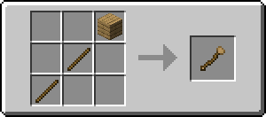
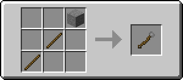
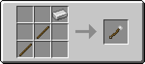
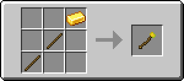
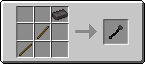

# Staff of Building

Staff of Building adds in new ~~wands~~ staffs which can be used to speed up building. 
It is built for the 1.16 snapshots on Fabric.
There is a staff for each material, as shown below:

##### Wooden
Radius: 1 

Durability: 100

##### Stone
Radius: 2

Durability: 250

##### Iron
Radius: 3

Durability: 500

##### Golden
Radius: 4

Durability: 150

##### Diamond
Radius: 4

Durability: 1000

##### Netherite
Radius: 5

Durability: 1250

### License

This mod is MIT. You are free to use the code and assets inside as you see fit. 
